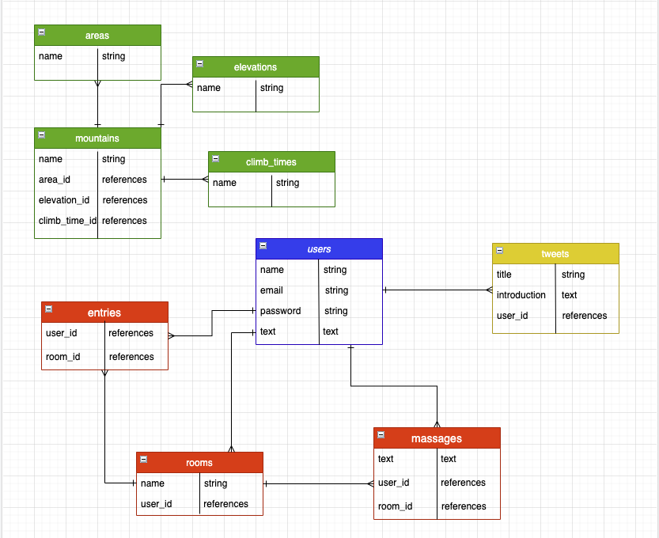

# MT.BEGINNER

## アプリケーション概要
もっと気軽に登山したい…という方に向けた複合サービスサイト。
登山したい山を検索する、山友達と交流する、写真を共有するを通じて登山を始める人達の応援を行うものです。

## URL
デプロイ後に記述

## 使用技術
* HTML/CSS
* JavaScript
* jQuery
* Ruby
* Ruby on Rails 6.0.0
* Bootstrap 4.5
* Git/GitHub
* VSCode
* Draw.io
* Adobe XD
* RSpec
* RuboCop
* Heroku

## 実装機能一覧
* 山の検索機能
* 写真共有機能
* チャットルーム作成機能

## 利用方法
* トップページでヘッダーからログイン・新規登録。
* ログイン後にハンバーガーメニューから山検索、写真投稿、チャットルーム作成、マイページへの遷移ができる。
* 山検索機能では、地域・標高・時間を入力することでおすすめの山を表示する。
* 写真投稿では写真・説明文・地域・標高を記載して投稿できる。投稿後はトップページに表示される。
* チャットルームでは登山に関しての情報交換、一緒に登るチームの結成を行える。
* マイページでは自身の写真、紹介文、投稿した写真、作成したチャットルームを表示する。

## 目指した課題解決
### ターゲット
20代男女。ネットで山を検索する人。大学生・社会人問わず。
### 課題解決
登山に興味がある人は多いですが、一歩踏み出せない方が多いように感じます。そのような人が登山を始めるきっかけになるアプリを目指しています。

## 実装した機能についてのGIFと説明
一通り機能が実装した後に記述

## 実装予定の機能
* 天気予報API
* コメント機能
* いいね機能
* 簡単ログイン機能
* 忘れ物チェック機能
* 複数枚写真投稿機能
* 登山カウンター機能
* SNS認証機能

## データベース設計

## ローカルでの動作方法
一通り機能が実装した後に記述
